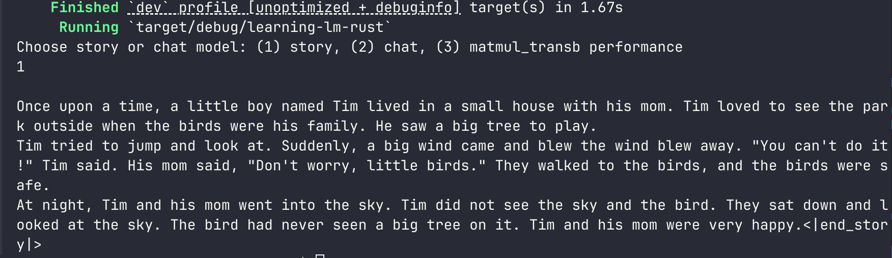
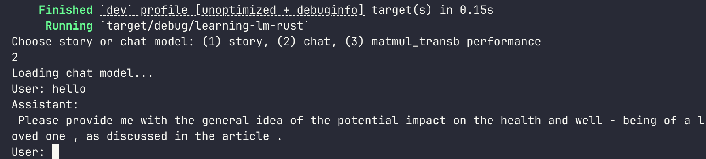
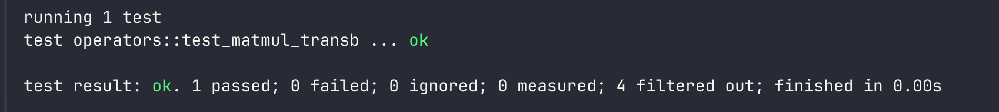
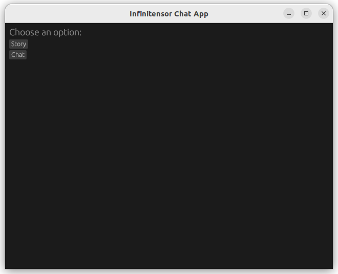
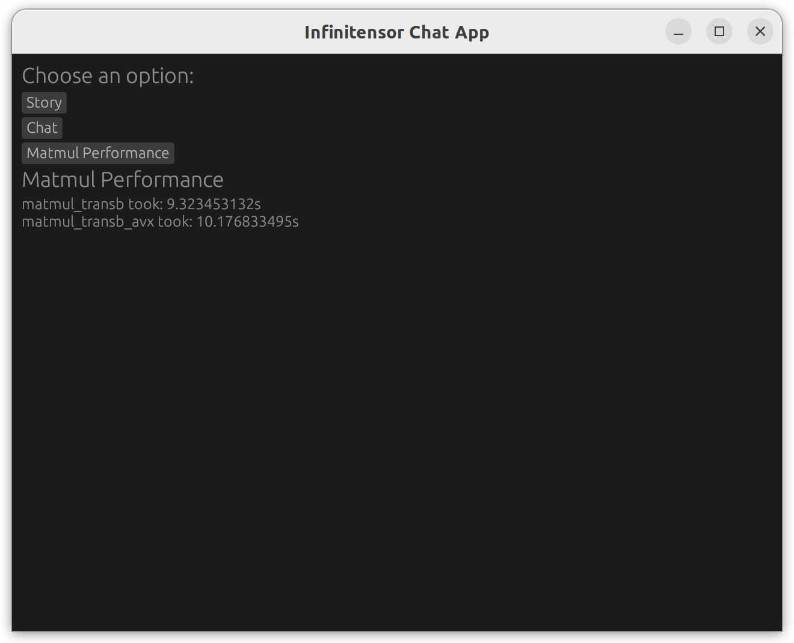
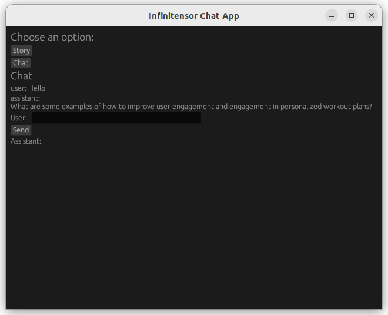

## 模型结构: self-attention & 文本生成
首先是Q*K^T，观察矩阵维度(seq_len, n_kv_h * n_groups * dqkv) @ (total_seq, n_kv_h * dqkv)^T，满足倍数关系，矩阵乘时可以对head除n\_groups

`forward`中，按照提示补充`self_attention`，`matmul_transb_avx`和`mlp`函数即可。

`generate`中，使用loop来获取输出

效果如下：



## 功能: AI对话
在release下载chat模型放入model目录，不同的是`需要在多轮对话中，保存和管理用户的kvcache`。所以替换为kvcache即可。在main函数中，也需要loop输出结果。

效果如下：



## avx
使用avx指令集来加速矩阵乘法，简单起见直接考虑机器是否支持avx指令集和是否能被8整除，每次步长为8

```rust
// https://doc.rust-lang.org/core/arch/index.html
#[cfg(target_arch = "x86_64")]
use std::arch::x86_64::*;
pub fn matmul_transb_avx(c: &mut Tensor<f32>, beta: f32, a: &Tensor<f32>, b: &Tensor<f32>, alpha: f32) {
    let a_shape = a.shape();
    let b_shape = b.shape();
    let (i, j, k) = (a_shape[0], b_shape[0], a_shape[1]);

    let _c = unsafe { c.data_mut() };
    let _a = a.data();
    let _b = b.data();

    if is_x86_feature_detected!("avx2") && k % 8 == 0 {
        unsafe {
            for x in 0..i {
                for y in 0..j {
                    let mut sum_vec = _mm256_setzero_ps();
                    for z in (0..k).step_by(8) {
                        let a_vec = _mm256_loadu_ps(_a.as_ptr().add(x * k + z));
                        let b_vec = _mm256_loadu_ps(_b.as_ptr().add(y * k + z));
                        sum_vec   = _mm256_fmadd_ps(a_vec, b_vec, sum_vec);
                    }
                    let mut sum_arr = [0.0; 8];
                    _mm256_storeu_ps(sum_arr.as_mut_ptr(), sum_vec);
                    let sum = sum_arr.iter().sum::<f32>();

                    _c[x * j + y] *= beta;
                    _c[x * j + y] += alpha * sum;
                }
            }
        }
    } else {
        ......
    }
}
```


通过test：



## egui
简单起见，这里使用rust的egui，我的想法就是两个不同的按钮，对应story和chat功能，点击story可以直接输出结果，点击chat还需要先手动输入。



