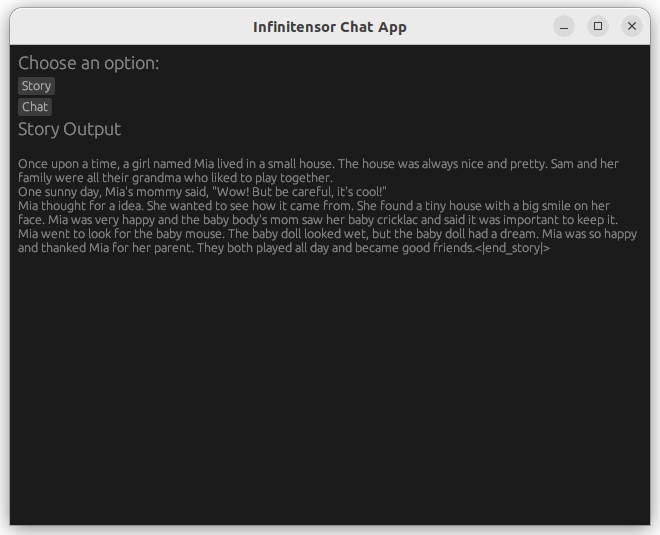

## 模型结构: self-attention & 文本生成
首先是$Q*K^T$，观察矩阵维度$(seq_len, n_kv_h * n_groups * dqkv) @ (total_seq, n_kv_h * dqkv)^T$，满足倍数关系，矩阵乘时可以对$head$除$n\_groups$

`forward`中，按照提示补充`self_attention`，`matmul_transb_avx`和`mlp`函数即可。

`generate`中，使用loop来获取输出

效果如下：

## 功能: AI对话
在release下载chat模型放入model目录，不同的是`需要在多轮对话中，保存和管理用户的kvcache`。所以替换为kvcache即可。在main函数中，也需要loop输出结果。

效果如下：

## avx
使用avx指令集来加速矩阵乘法，简单起见直接考虑机器是否支持avx指令集和是否能被8整除，每次步长为8

对比普通矩阵乘：

通过test：

## egui
简单起见，这里使用rust的egui，我的想法就是两个不同的按钮，对应story和chat功能，点击story可以直接输出结果，点击chat还需要先手动输入。

